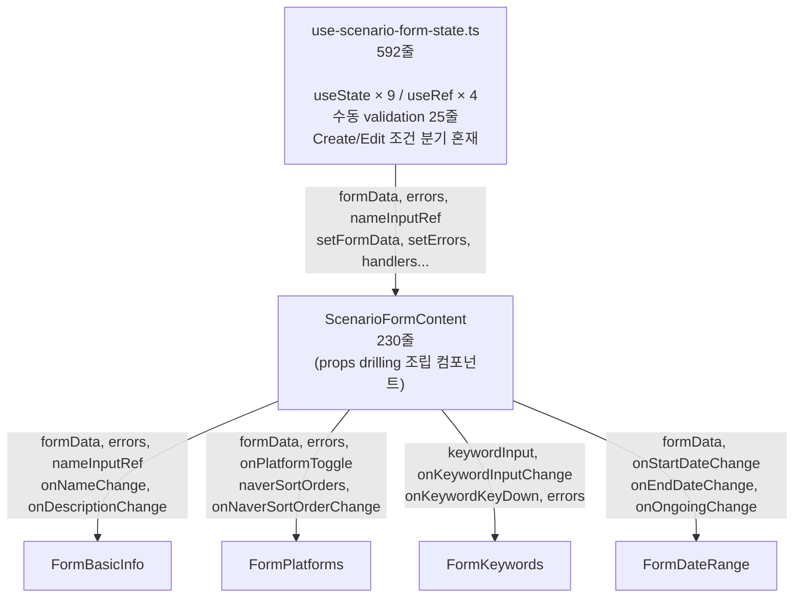
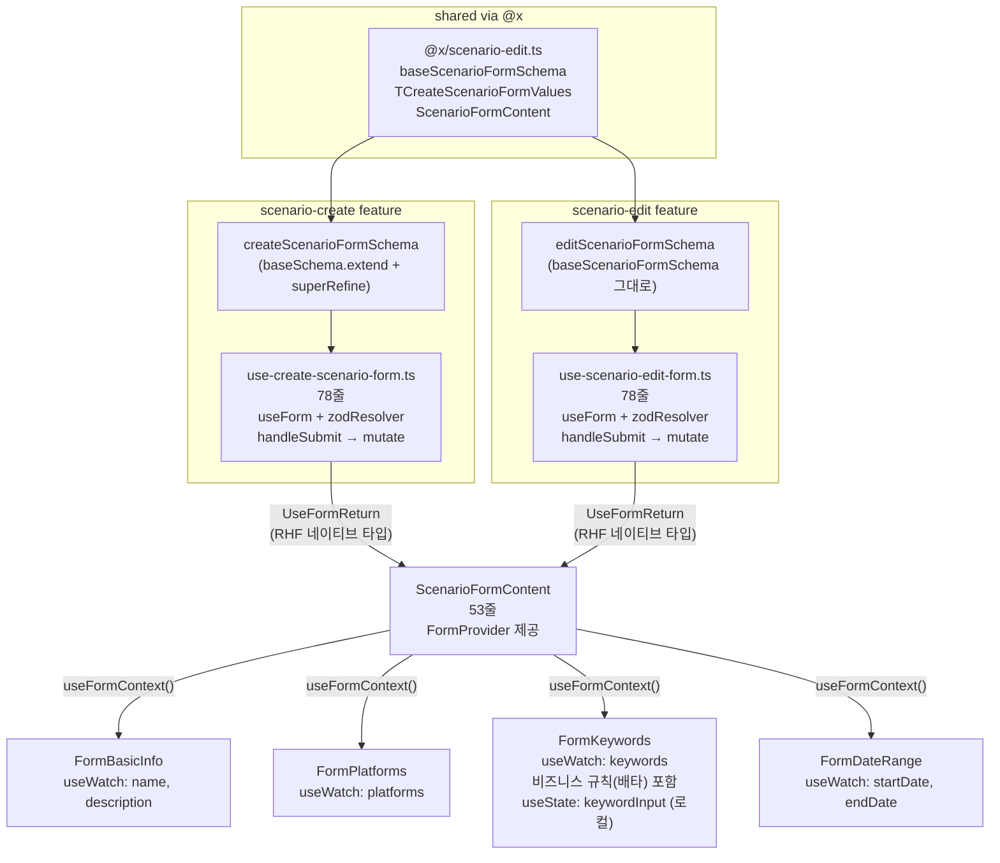
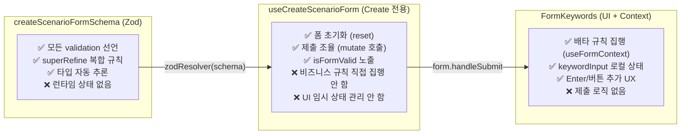
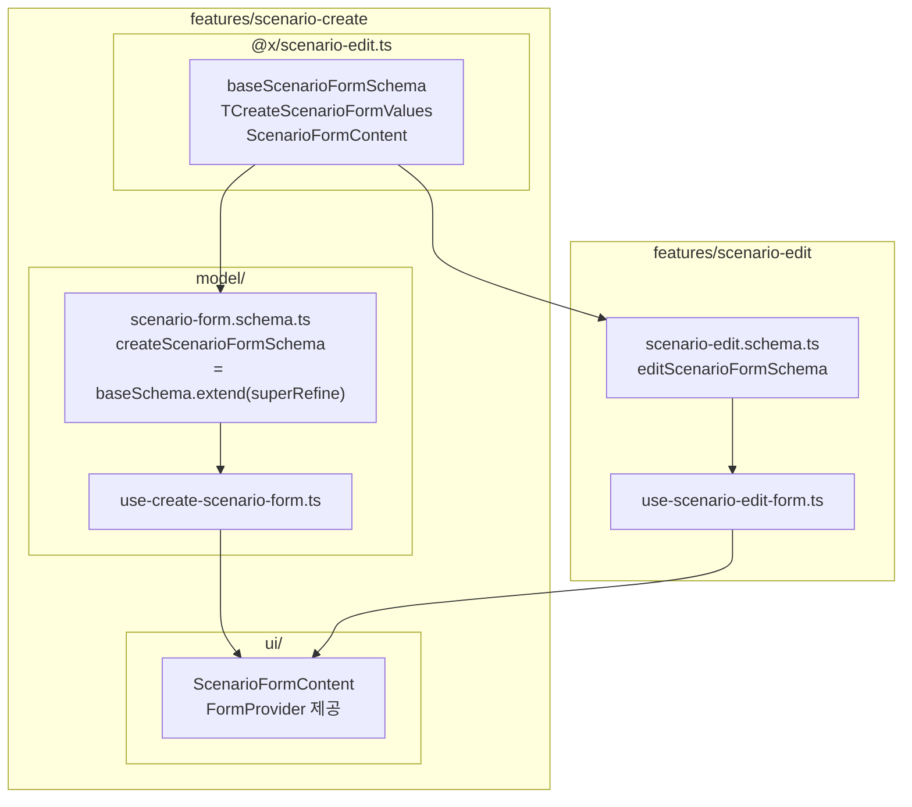
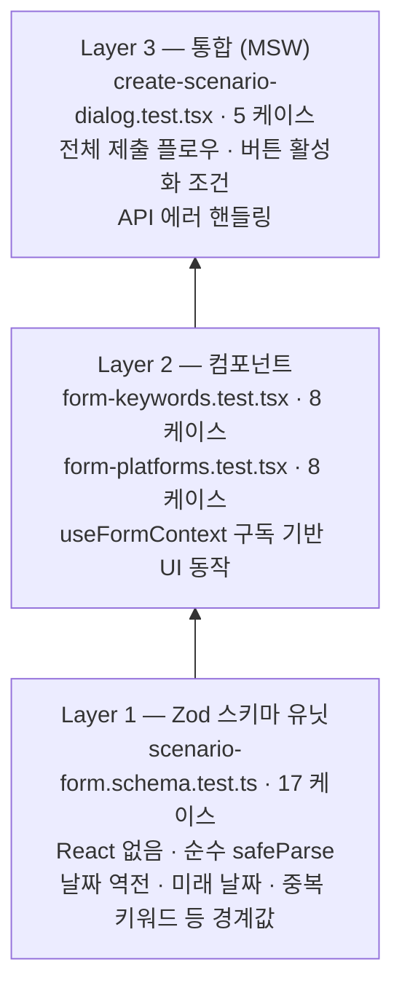

## React Hook Form + Zod 도입: 시나리오 폼 아키텍처 리팩터링

---

### Summary

| 지표                        | Before                                    | After                          | 개선                     |
| --------------------------- | ----------------------------------------- | ------------------------------ | ------------------------ |
| 핵심 폼 훅                  | `use-scenario-form-state.ts` 592줄 (단일) | create 78줄 + edit 78줄 (분리) | **436줄 순 감소 (-74%)** |
| `scenario-form-content.tsx` | 230줄                                     | 53줄                           | **-177줄 (-77%)**        |
| 시나리오 폼 전체 변경       | —                                         | 1,049줄 추가 / 1,277줄 삭제    | **순 228줄 감소**        |
| 훅 내 `useState` / `useRef` | 9개 / 4개                                 | 0개 / 0개                      | **100% 제거**            |
| 시나리오 폼 테스트 케이스   | 32개                                      | 50개                           | **+56%**                 |

---

### Problem

시나리오 생성/수정 폼이 성장하면서 단일 커스텀 훅(`use-scenario-form-state.ts`, 592줄)이 세 가지 책임을 동시에 떠안게 되었습니다.

**1. 비대해진 로컬 상태 — `useState` 9개 + `useRef` 4개가 훅 한 곳에 집중**

```typescript
// ❌ Before: use-scenario-form-state.ts (592줄)
const nameInputRef = useRef<HTMLInputElement>(null);
const galleryInputRef = useRef<HTMLInputElement>(null);
const authorInputRef = useRef<HTMLInputElement>(null);

const [errors, setErrors] = useState<IScenarioFormErrors>({});
const [formData, setFormData] =
    useState<IScenarioFormState>(DEFAULT_FORM_STATE);
const [keywordInput, setKeywordInput] = useState("");
const [excludeKeywordInput, setExcludeKeywordInput] = useState("");
const [authorInput, setAuthorInput] = useState("");
const [boardInput, setBoardInput] = useState("");
const [boardSearchQuery, setBoardSearchQuery] = useState("");
const [showBoardResults, setShowBoardResults] = useState(false);
const [showAuthorBoardResults, setShowAuthorBoardResults] = useState(false);
```

**2. 명령형 validation — submit 시 `setErrors` + `if-else` 분기 25줄이 훅에 산재**

```typescript
// ❌ Before
const newErrors: IScenarioFormErrors = {};

if (!formData.name.trim()) {
    newErrors.name = true;
    setErrors(newErrors);
    toast.error("시나리오명을 입력해주세요");
    nameInputRef.current?.focus();
    return;
}
if (formData.platforms.length === 0) {
    newErrors.platforms = true;
    setErrors(newErrors);
    toast.error("최소 1개 플랫폼을 선택해주세요");
    return;
}
// ... 필드가 늘어날수록 if-else도 비례 증가
```

에러 타입 `IScenarioFormErrors { name?: boolean, platforms?: boolean }`는 "에러 유/무"만 표현 가능하고, 에러 메시지 문자열은 별도 `toast` 호출로 흩어져 관리했습니다.

**3. 과도한 props drilling — 230줄 짜리 조립 컴포넌트**

```typescript
// ❌ Before: scenario-form-content.tsx (230줄)
<FormBasicInfo
  formData={form.formData}
  errors={form.errors}
  nameInputRef={form.nameInputRef}
  onNameChange={(name) => {
    form.setFormData((prev) => ({ ...prev, name }));
    if (form.errors.name && name.trim())
      form.setErrors((prev) => ({ ...prev, name: false }));
  }}
  ...
/>
<FormPlatforms
  platforms={form.formData.platforms}
  errors={form.errors}
  onPlatformToggle={form.handlePlatformToggle}
  naverPlatformSortOrders={form.formData.naverPlatformSortOrders}
  ...
/>
```

**4. Create/Edit이 하나의 훅에서 조건 분기로 공존**

`mode === "create" | "edit"` 분기가 훅 곳곳에 퍼져 있어, 두 모드 중 어느 하나를 수정할 때 서로에게 영향을 줄 가능성이 상존했습니다.

---

### Investigation

**렌더링 범위 문제 — 제어 vs 비제어 컴포넌트**

기존 방식은 `useState`로 모든 입력값을 관리하는 **제어 컴포넌트(Controlled)** 였습니다. 키 입력 한 번마다 `setFormData`가 호출되고, 이 상태를 구독하는 컴포넌트 트리 전체가 리렌더됩니다.

RHF는 내부적으로 `useRef`로 DOM 입력값을 직접 관리하는 **비제어 컴포넌트(Uncontrolled)** 방식을 기반으로 합니다. React 렌더 사이클을 거치지 않고 입력값을 추적하므로, 구독하지 않은 컴포넌트는 리렌더되지 않습니다. `useWatch({ name: "..." })`를 각 컴포넌트 내부에서 직접 호출하면 해당 컴포넌트만 리렌더 범위로 한정됩니다.

이 차이는 단순한 숫자 최적화가 아니라, **저사양 환경에서 타이핑 시 발생하는 입력 지연(Input Lag)을 방지**합니다. 폼 필드가 많아질수록 복잡한 렌더 트리를 매 입력마다 재계산하는 비용이 UX에서 체감되는 응답 지연으로 이어지기 때문입니다.

**Zod 선택 근거**

Yup, Joi 등 대안 대비 Zod를 선택한 이유는 세 가지입니다.

- **TypeScript-first**: `z.infer<typeof schema>`로 폼 값 타입이 자동 추론됩니다. 스키마와 타입을 따로 관리하는 중복이 없습니다.
- **`superRefine`**: 복수 필드 간 관계(날짜 역전, 배타 규칙 등)를 `ctx.addIssue({ path: ["endDate"] })`로 특정 필드에 귀속시킬 수 있어, RHF의 `formState.errors`와 자연스럽게 연결됩니다.
- **`@hookform/resolvers` 공식 지원**: `zodResolver(schema)` 한 줄로 RHF와 연결됩니다.

---

### Architecture: Before vs After

**Before — 단일 훅이 Create/Edit 모드를 조건 분기로 처리**



**After — Create/Edit 독립 분리 + RHF Context가 상태 채널**



---

### Solution

**① 스키마 계층화 — base → create / edit 확장**

```typescript
// @x/scenario-edit.ts (Create-Edit 공통 기반)
export const baseScenarioFormSchema = z.object({
  name: z.string().min(1, "시나리오명을 입력해주세요").max(SCENARIO_NAME_MAX_LENGTH, ...),
  platforms: z.array(z.enum(PLATFORM_KEYS)),  // 필수 없음 (Edit은 불필요)
  keywords: z.array(z.string().max(KEYWORD_ITEM_MAX_LENGTH)),
  startDate: z.date().nullable(),
  // ...공통 필드 구조
});

// scenario-form.schema.ts (Create 전용 — base를 확장)
export const createScenarioFormSchema = baseScenarioFormSchema
  .extend({
    platforms: z.array(z.enum(PLATFORM_KEYS)).min(1, "최소 1개 플랫폼을 선택해주세요"),
    keywords: z.array(...).min(1, "키워드는 1개 이상 입력해주세요")
              .refine((kws) => new Set(kws).size === kws.length, "키워드는 중복되지 않아야 합니다"),
  })
  .superRefine((data, ctx) => {
    // Create에만 필요한 날짜 교차 검증
    if (!data.startDate) {
      ctx.addIssue({ code: "custom", path: ["startDate"], message: "시작일을 선택해주세요" });
      return;
    }
    if (!data.isOngoing && data.endDate && data.endDate < data.startDate) {
      ctx.addIssue({ code: "custom", path: ["endDate"], message: "종료일은 시작일 이후여야 합니다" });
    }
  });

export type TCreateScenarioFormValues = z.infer<typeof createScenarioFormSchema>;
//                                      ↑ 타입이 스키마에서 자동 추론됨

// scenario-edit.schema.ts (Edit 전용 — base 그대로, superRefine 불필요)
export const editScenarioFormSchema = baseScenarioFormSchema;
// Edit은 날짜·플랫폼·키워드가 비활성화 상태라 추가 검증이 필요 없음
```

**② Create/Edit 훅 완전 분리 — 각 78줄, 단일 책임**

```typescript
// ✅ After: use-create-scenario-form.ts (78줄)
export function useCreateScenarioForm({
    open,
    projectId,
    prefillData,
    onSuccess,
}) {
    const form = useForm<TCreateScenarioFormValues>({
        resolver: zodResolver(createScenarioFormSchema),
        defaultValues: CREATE_FORM_DEFAULT_VALUES,
        mode: "onChange",
    });

    const { mutate, isPending } = useCreateScenario();

    useEffect(() => {
        if (!open) return;
        form.reset(
            prefillData
                ? mapPrefillToScenarioForm(prefillData)
                : CREATE_FORM_DEFAULT_VALUES,
        );
    }, [open, prefillData, form]);

    const handleSubmit = () => {
        void form.handleSubmit((data) => {
            const payload = mapScenarioFormToCreatePayload(data, projectId);
            mutate(payload, {
                onSuccess: () => {
                    form.reset(CREATE_FORM_DEFAULT_VALUES);
                    onSuccess();
                },
            });
        })();
    };

    return {
        form,
        handleSubmit,
        isSubmitting: isPending,
        isFormValid: form.formState.isValid,
        mode: "create",
    };
}
```

**③ `ScenarioFormContent` — props 최소화, `UseFormReturn` 직접 수용**

```typescript
// ❌ Before: 커스텀 훅 반환 객체 전체를 props로
interface IScenarioFormContentProps {
  form: TUseScenarioFormReturn;  // formData, errors, handlers... 모두 포함
}

// ✅ After: RHF 네이티브 타입 + 최소한의 메타데이터만
interface IScenarioFormContentProps {
  form: UseFormReturn<TCreateScenarioFormValues>;  // RHF 표준 타입
  mode: "create" | "edit";
  editableFields?: readonly string[];
}

export function ScenarioFormContent({ form, mode, editableFields = [] }) {
  return (
    <FormProvider {...form}>   {/* 하위 컴포넌트가 useFormContext로 직접 접근 */}
      <div className="space-y-6 py-4">
        <FormBasicInfo nameDisabled={...} descriptionDisabled={...} />
        <FormPlatforms disabled={isEdit} />
        <FormKeywords type="keyword" disabled={isEdit} />
        <FormKeywords type="excludeKeyword" disabled={isEdit} />
        <FormDateRange disabled={isEdit} />
        <FormSleepH disabled={...} />
      </div>
    </FormProvider>
  );
}
```

**④ 비즈니스 규칙의 위치 — 훅이 아닌 컴포넌트가 Context로 직접 집행**

이전 중간 단계에서는 키워드-제외키워드 배타 규칙을 훅(`use-scenario-form-base.ts`)에서 처리했습니다. 현재는 `FormKeywords` 컴포넌트가 `useFormContext`를 통해 직접 폼 상태에 접근하여 이 규칙을 처리합니다. 훅은 "어떤 비즈니스 규칙을 집행하는가"가 아니라 "폼 초기화와 제출 조율"만 담당합니다.

```typescript
// ✅ After: FormKeywords 내부 — useFormContext로 직접 제어
export function FormKeywords({ type, disabled }) {
    const { setValue, getValues } = useFormContext<TCreateScenarioFormValues>();
    const [keywordInput, setKeywordInput] = useState(""); // UI 버퍼 상태는 로컬

    const handleAdd = useCallback(() => {
        const keyword = keywordInput.trim().slice(0, KEYWORD_ITEM_MAX_LENGTH);
        if (!keyword || getValues(fieldName).includes(keyword)) {
            setKeywordInput("");
            return;
        }

        setValue(fieldName, [...getValues(fieldName), keyword], {
            shouldValidate: true,
        });
        // 반대 필드에 있으면 제거 (배타적 관계) — 컴포넌트가 자체 집행
        const opposite = getValues(oppositeFieldName).filter(
            (k) => k !== keyword,
        );
        setValue(oppositeFieldName, opposite);
        setKeywordInput("");
    }, [keywordInput, fieldName, oppositeFieldName, setValue, getValues]);
}
```

---

### Design Philosophy: SRP와 상태 소유권



**상태 위치 결정 원칙:**

- "Submit 시 서버로 가는 데이터" → RHF 폼 상태 (`setValue`, `getValues`)
- "입력 중인 임시값으로 제출과 무관" → 컴포넌트 로컬 `useState`
- "validation 규칙" → Zod 스키마

---

### FSD 레이어와 `@x` 패턴



`scenario-edit`이 `scenario-create`의 내부를 직접 import하는 대신 `@x/scenario-edit.ts`를 통해서만 접근합니다. `baseScenarioFormSchema`(공통 필드 구조)와 `ScenarioFormContent`(공통 UI)는 이 채널을 통해 공유되며, Create 전용 validation(`superRefine`)은 `scenario-create` 내부에만 존재합니다.

---

### Test Strategy: 4-Layer



> 훅 유닛 테스트(`use-scenario-form-state.test.ts`)를 제거한 이유: 기존 12개의 훅 유닛 테스트는 `useState` 기반 로직을 직접 검증했습니다. RHF + Zod 전환 후 이 로직은 ①스키마(Layer 1에서 검증), ②RHF 내부(라이브러리가 보증), ③통합 테스트(Layer 3)로 분산됩니다. 훅 자체를 별도로 유닛 테스트할 대상 로직이 더 이상 없어 제거했습니다.

**스키마 유닛 테스트 예시 — `superRefine` 경계값 검증:**

```typescript
it("endDate가 startDate보다 이른 날짜면 실패한다", () => {
    const result = createScenarioFormSchema.safeParse({
        ...validBase,
        isOngoing: false,
        startDate: new Date(2025, 0, 10),
        endDate: new Date(2025, 0, 5), // 역전
    });
    expect(result.success).toBe(false);
});

it("isOngoing=true면 endDate가 null이어도 통과한다", () => {
    const result = createScenarioFormSchema.safeParse({
        ...validBase,
        isOngoing: true,
        endDate: null,
    });
    expect(result.success).toBe(true); // 진행 중 시나리오는 종료일 불필요
});
```

---

### Result & Impact

**코드량 (Before: `bd37a21` → After: 현재 HEAD)**

| 파일                         | Before | After                       | 변화              |
| ---------------------------- | ------ | --------------------------- | ----------------- |
| `use-scenario-form-state.ts` | 592줄  | **삭제**                    | -592줄            |
| 대체: create + edit 훅       | —      | 78 + 78 = 156줄             | —                 |
| `scenario-form.schema.ts`    | 없음   | 162줄 (신규)                | —                 |
| `scenario-form-content.tsx`  | 230줄  | 53줄                        | **-177줄 (-77%)** |
| 전체 순 변화 (피처 기준)     | —      | 1,015줄 추가 / 1,277줄 삭제 | **순 262줄 감소** |

**상태 관리**

| 항목                   | Before                              | After                        |
| ---------------------- | ----------------------------------- | ---------------------------- |
| 훅 내 `useState`       | 9개                                 | 0개                          |
| 훅 내 `useRef`         | 4개                                 | 0개                          |
| 수동 validation 분기문 | 25줄                                | 0줄 (Zod 스키마로 대체)      |
| 에러 타입              | `{ name?: boolean }` boolean 플래그 | Zod field별 메시지 문자열    |
| Create/Edit 분리       | 조건 분기로 단일 훅에 공존          | 독립적인 두 훅으로 완전 분리 |

**테스트**

| 항목                      | Before                | After                              |
| ------------------------- | --------------------- | ---------------------------------- |
| 시나리오 폼 테스트 파일   | 3개                   | 6개                                |
| 시나리오 폼 테스트 케이스 | 32개                  | 50개 **(+18, +56%)**               |
| 커버 레이어               | 훅 유닛, payload 변환 | 스키마 유닛 / 컴포넌트 / 통합(MSW) |

**Evidence:** 커밋 [`d4eb1ee`](https://github.com/Harvester-LALA/lala-frontend/commit/d4eb1ee) (zod 도입) · [`586f3be`](https://github.com/Harvester-LALA/lala-frontend/commit/586f3be) (RHF 적용) · [`72e5e99`](https://github.com/Harvester-LALA/lala-frontend/commit/72e5e99) (base hook 제거·분리) · [`f9563ae`](https://github.com/Harvester-LALA/lala-frontend/commit/f9563ae) (스키마 계층화)
